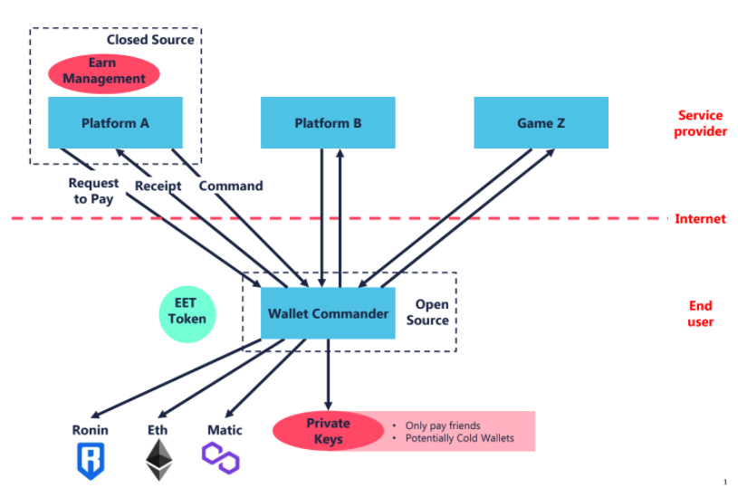
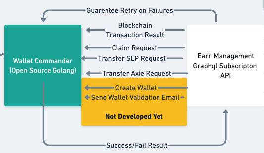

# Wallet Commander CLI
[Join the conversation in Discord](https://discord.gg/GD65eQuVGz) - Earn Alliance Community#wallet-commander channel

## Introduction
The wallet commander is used for signing blockchain operations for 3rd party platforms.
For blockchains like axie infinity's Ronin Network, it's not possible to deploy smart contracts to execute
complex operations in a decentralized fashion. In general, decentralized finance may require
to process large amounts of data which would be inefficient to store on the blockchain and would be better to only derive a set of 
transactions to be executed. With the rise in GameFi, investors are managing thousands of wallets and 
require to sign many transactions with many private keys which is cumbersome. The **Wallet Commander** enables 3rd party platforms to calculate a set of blockchain transactions which
can be signed and executed by the owner of the set of wallets.

This project is meant to be open for anyone to share and build on top of. Starting with [Earn Alliance](https://earnalliance.com) as the first
approved platform to be pre-built into the CLI, the CLI should be flexible to accept commands from any Wallet Commander API service without
the need to create a custom command.



### How it works
A platform may provide a wallet-commander graphql api server which has a queue of blockchain operations they wish their customers to sign.
The `wallet-commander` cli picks up commands and signs the requests on behalf of the platform.
The cli will have access to locally stored private keys and (soon) a whitelist of operations that are allowed to be done with the keys.
Upon signing the operation, the transaction or error will be provided to the wallet-commander graphql api server.
Depending on what was written, the server should then verify that the transaction has been successful, retry on failure or provide user feedback on the platfrom about the error.



## Installation

The following instructions will enable you to install the CLI locally on your machine so you may
process commands from a 3rd party platform.

### Mac / Linux
#### Requirements
- Ensure `unzip` is installed on your linux machine. If you don't already have it install it using `sudo apt-get install -y unzip` or similar command depending on your linux distro.

Run the following installation script to install the `wallet-commander` CLI to its default location `usr/local/bin`

```
curl -L https://raw.githubusercontent.com/earn-alliance/wallet-commander-cli/main/install.sh | bash
```

### Windows
#### Requirements

- Windows 7 SP1+ / Windows Server 2008+
- [PowerShell 5](https://aka.ms/wmf5download) (or later, include [PowerShell Core](https://docs.microsoft.com/en-us/powershell/scripting/install/installing-powershell-core-on-windows?view=powershell-6))
- PowerShell must be enabled for your user account e.g. `Set-ExecutionPolicy -ExecutionPolicy RemoteSigned -Scope CurrentUser`
- Run PowerShell as Administrator to avoid any errors.

Run the following command from your PowerShell to install the `wallet-comander` CLI to its default location `C:\Users\<user>\kinto`

```
Invoke-Expression (New-Object System.Net.WebClient).DownloadString('https://raw.githubusercontent.com/earn-alliance/wallet/main/install.ps1')
```

OR

```
iwr -useb raw.githubusercontent.com/kintoproj/kinto-cli/main/install.ps1 | iex
```

`Note :` You can also download the latest available release for your Operating System from [releases](https://github.com/kintoproj/kinto-cli/releases) and add it to your global `PATH` manually.

## Usage

Currently, there is only one command available for the CLI

### wallet-commander start {platform-name} --client-id {client-id}

This starts processing all pending operations that the platform wishes you to sign.
When signing up for the platform, there should be a `client-id` available for you to enter.
In the future, there will be a secret key pair required.

Current platform names that are supported:

* **earn-alliance**

## Local Development

To contribute to developing this CLI, you need goland v1.17 or higher installed.

### Regenerating contracts

You must have abigen installed.

**Mac installation**

```
brew tap ethereum/ethereum
brew install ethereum
```

**Linux installation**

```
sudo apt-get install ethereum-unstable
```

Once abigen is installed, you can then run `./regenerate_contracts.sh` which will
apply all ./abis contracts into ./pkg/abi/. We use ABIs format for ease of customizing
the smart contracts that we wish to call.

## Contributing

### Project Structure

Kinto CLI follows the following **temporary** structure which will be refactored in the near future

```
wallet-commander-cli
 |── internal
     ├── cli - all cli business logic and bootstrapping
     ├── config - basic configuration such as version for CLI
     ├── controller - business logic for signing wallet commands
     ├── log - functionality for bootstraping logging
     ├── query - (refactor => store) all wallet commander graphql API queries reside here
     ├── server - (refactor => client) running executable that connects to wallet-commander server
     ├── store - all business logic for executing wallet commander graphql API queries
     ├── types - all structs for wallet-commander business logic
     └── vault - logic for loading private keys
 |── internal
      ├── abi - (refactor => go-axie-infinity-client) auto-generated blockchain smart contract clients
      ├── api - public wallet commander API structs
      ├── client (refactor => go-axie-infinity-client) client for on-chain and off-chain data for axie infinity
      ├── constants - (refactor => go-axie-client) constants used for client
      ├── store - (refactor => go-axie-client) in-memory JWT token store and future utils for caching API calls
      ├── types - (refactor => go-axie-client) client types
      └── wallet - (refactor => client) 3rd party developer created a 2nd client here for wallets
```

### Needed help

There are urgent tasks required to get this client cleaned up for production use. More tasks to come, for now they are listed below

- [ ] Whitelist functionality to block illegal transactions
- [ ] Refactor out all axie client related logic in `pkg` to a 3rd party repo `go-axie-infinity-client`
- [ ] Create functionality to target custom platform to consume events
- [ ] Document client and server API
- [ ] Check for CLI updates every 24 hours
- [ ] Environment variable options for CLI arguments `--client-id { } OR ${CLIENT_ID}`
- [ ] Server docker image
- [ ] Support dynamic private keys from 3rd party DB

### Future

In the future, wallet-commander will have a public API where 3rd party platforms can escrow encrypted blockchain operations which can be redeemed after paying a fee.
Initially the backend-api server will be closed source, but anyone may build their own backends or platforms and receive fees for enabling usage within the community.

Reach out to discuss more about the future of the project on [discord](https://discord.gg/GD65eQuVGz).